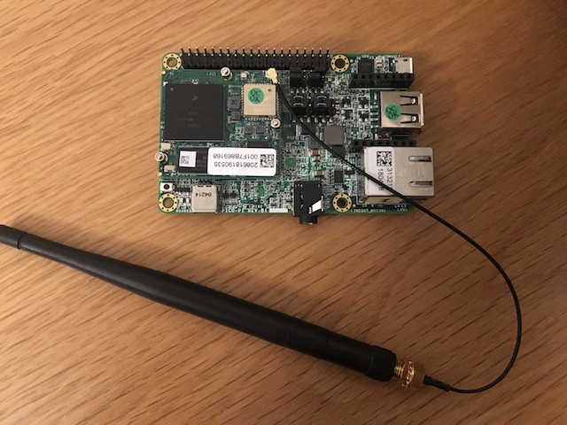
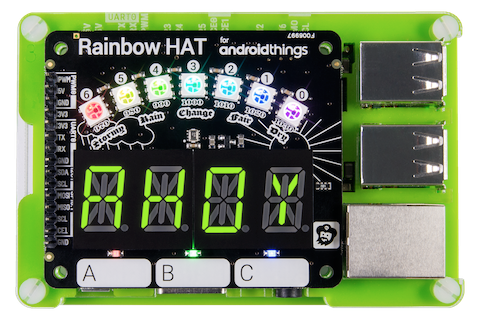

EPF IoT class Hands-on 
======================

This is a fork of Android Things weather station codelab, prepared for EPF IoT course 2018-2019.

# Prerequisite

- A PC or a Mac with latest [Android Studio](https://developer.android.com/studio/) installed
- An [Android Things starter kit](https://androidthings.withgoogle.com/#!/kits/starter-kit) with the latest image installed
- Basic knowledge of Linux/Unix system
- Basic knowledge of Android development
- Basic knowledge of Java or Kotlin

Let's get started! 💪🏻

# Preparation

The board given to each of you is already flashed with the latest version of Android Things. The main board is a NXP Pico i.MX7 Dual development board.

## Set up your Android Things board

First plug the wifi antenna, then the Rainbow HAT onto your Pico board.




### Optional: Multi-touch display

If you want to set up the multi-touch display, follow the instruction of Multi-touch display section [here](https://androidthings.withgoogle.com/#!/kits/starter-kit). Don't hesitate to ask for help. 


## Set up ADB

Make sure you already installed the latest stable release of Android Studio. Go to `menu -> Preferences -> Android SDK` and find your Android SDK location (e.g. `/Users/qian/Library/Android/sdk/`)
- Add SDK's `platform-tools` to your path. An example for MAC user, add following line in your `.bash_profile` or `.bashrc`:

```
export PATH="/Users/qian/Library/Android/sdk/platform-tools:$PATH"
```

This will allow you to use ADB (Android Debug Bridge) easily from a terminal. Once you have adb ready, plug Android Things board and verify if it's properly connected:

```
$ adb devices
List of devices attached
xxxxxx  device
```

Make sure you can access adb shell:
```
$ adb shell
imx7d_pico:/ $ 
```

## Other setups

The board handed to you is already flashed with the latest version of Android Thing and pre-configured with the following wifi:

- SSID: `things`
- Password: `HelloAndroidThings`

If you need do some further setups (flashing board, set up wifi...), download the [Android Things Setup Utility](https://partner.android.com/things/console/#/tools) from the Android Things Console. You will need to sign in to your Google account and accept the licensing agreement and terms of service.

# Get Started

In this hands-on, you're going to build a weather station that reads temperature and pressure data from a BMP280 sensor and displays the latest reading locally on the [Rainbow HAT](https://shop.pimoroni.com/products/rainbow-hat-for-android-things).

## About the hardware

The expansion connector on the development board exposes Peripheral I/O signals for application use. The Rainbow HAT sits on top of the expansion connector, providing a variety of inputs and outputs for developers to interact with.



The peripherals on the Rainbow HAT used in this codelab are connected to the following signals. These are also listed on the back of the Rainbow HAT:

- [BMP280 Environmental Sensor](https://cdn-shop.adafruit.com/datasheets/BST-BMP280-DS001-11.pdf)
- [HT16K33 Segment Display](https://cdn-shop.adafruit.com/datasheets/ht16K33v110.pdf)
- [APA102 RGB LED Strip](https://cdn-shop.adafruit.com/datasheets/APA102.pdf)

> This hands-on makes use of the [RainbowHat driver](https://github.com/androidthings/contrib-drivers/tree/master/rainbowhat) to provide access to the individual peripherals, so these signal names are for your information only. Your code will access these peripherals through the RainbowHat class.

## Playground

Before start building the weather station, let's get familiar with the board by playing with some of the component on the Rainbow HAT. Open the playground project inside this repository with Android Studio and go to `MainActivity.java`.

### Add Permission

In order to manipulate peripheral pins, you have to add this permission in `AndroidManifest.xml`:

```
<uses-permission android:name="com.google.android.things.permission.USE_PERIPHERAL_IO"/>
```

### Add Rainbow HAT driver 🌈

The [RainbowHat driver](https://github.com/androidthings/contrib-drivers/tree/master/rainbowhat) provides easy access to the peripherals available on the Rainbow Hat for Android Things, add the dependency in the `build.gradle` of your application (path: `playground/app/build.gradle`):

```
implementation 'com.google.android.things.contrib:driver-rainbowhat:1.0'
```

### Basic GPIO: LED 🚥

LED is controlled by a digital GPIO pin, there are 3 LEDs on the rainbow HAT, their pin names mapping with Rainbow HAT on a Pico board are:

- Red LED: `GPIO2_IO02`
- Green LED: `GPIO2_IO00`
- Blue LED: `GPIO2_IO05`

In order to manipulate them, you can use `PeripheralManager`, try to add this code inside `onCreate()` and launch it on your Android Things:

```java
private Gpio redLed;

@Override
protected void onCreate(Bundle savedInstanceState) {
    super.onCreate(savedInstanceState);
	
	PeripheralManager service = PeripheralManager.getInstance();
	Gpio redLed = service.openGpio(GPIO_RED_LED);
	redLed.setDirection(Gpio.DIRECTION_OUT_INITIALLY_LOW);
	redLed.setValue(true);
}
```

The `setDirection` method sets the GPIO pin's initial value as low, which means the LED is not lit.

When you are done with the GPIO pin, dont forget to close it in `onDestry()` method to free the resource:

```java
@Override
protected void onDestroy() {
    super.onDestroy();
    redLed.close();
}
```

You are probably noticing that IDE is underlining the `openGpio` method, telling you there is unhandled IOException, so don't forget to wrap your code inside a `try catch`.

With the Rainbow HAT driver, the same code can actually be much simpler:

```java
redLed = RainbowHat.openLedRed();
redLed.setValue(true);
redLed.close();
```

#### 💻 Exercise 💻

Light up the red and blue light while keeping the green off. 

Raise hands when you are done 👋🏻

### Basic GPIO: Button 🕹

Now you know how output can be controlled from code, let's check out how to play with the input. One of the input on the rainbow HAT is the button. There are 3 buttons: Button A, B and C.

Following code shows how to detect when the button A is pressed:

```java
// Detect when button 'A' is pressed.
Button button = RainbowHat.openButtonA();
button.setOnButtonEventListener(new Button.OnButtonEventListener() {
    @Override
    public void onButtonEvent(Button button, boolean pressed) {
        Log.d(TAG, "button A pressed:" + pressed);
    }
});

// Close the device when done.
button.close();
```

Every time the button is pressed, the `OnButtonEventListener` will received the event, thus you can carry out actions inside the callback. Read carefully with the log to understand the behavior of the button and how the boolean `pressed` changed.

#### 💻 Exercise 💻

Control the led with your button, for example, when press on the button A, the red LED is lit; when the button is pressed again, the red LED is turned off. Raise hands when you are done 👋🏻

## Get the starter project

## Write display data

## Read sensor data


# Reference

- https://codelabs.developers.google.com/codelabs/androidthings-weatherstation
- https://github.com/androidthings/weatherstation