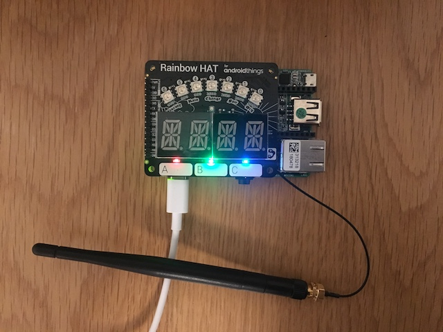

EPF IoT class Hands-on 
======================

This is a fork of Android Things weather station codelab, prepared for EPF IoT course 2018-2019.

# Prerequisite

- A PC or a Mac with latest [Android Studio](https://developer.android.com/studio/) installed
- An Android Things starter kit with the latest image installed
- Basic knowledge of Linux/Unix system
- Basic knowledge of Android development
- Basic knowledge of Java or Kotlin

# Preparation

The board given to each of you is already flashed with the latest version of Android Things.

## Set up your Android Things board

First plug the wifi antenna, then the Rainbow HAT onto your Pico board.




### Optional: Multi-touch display

If you want to set up the multi-touch display, follow the instruction of Multi-touch display section [here](https://androidthings.withgoogle.com/#!/kits/starter-kit). Don't hesitate to ask for help. 


## Set up ADB

Make sure you already installed the latest stable release of Android Studio. Go to `menu -> Preferences -> Android SDK` and find your Android SDK location (e.g. `/Users/qian/Library/Android/sdk/`)
- Add SDK's `platform-tools` to your path. An example for MAC user, add following line in your `.bash_profile` or `.bashrc`:

```
export PATH="/Users/qian/Library/Android/sdk/platform-tools:$PATH"
```

This will allow you to use ADB (Android Debug Bridge) easily from a terminal. Once you have adb ready, plug Android Things board and verify if it's properly connected:

```
$ adb devices
List of devices attached
xxxxxx  device
```

Make sure you can access adb shell:
```
$ adb shell
imx7d_pico:/ $ 
```

## Other setups

The board handed to you is already flashed with the latest version of Android Thing and pre-configured with the following wifi:

- SSID: things
- Password: HelloAndroidThings

If you need do some further setups (flashing board, set up wifi...), download the [Android Things Setup Utility](https://partner.android.com/things/console/#/tools) from the Android Things Console. You will need to sign in to your Google account and accept the licensing agreement and terms of service.

# Get Started

In this hands-on, you're going to build a weather station that reads temperature and pressure data from a BMP280 sensor and displays the latest reading locally on the [Rainbow HAT](https://shop.pimoroni.com/products/rainbow-hat-for-android-things).

This hands-on makes use of the [RainbowHat driver](https://github.com/androidthings/contrib-drivers/tree/master/rainbowhat) to provide access to the individual peripherals, so these signal names are for your information only. Your code will access these peripherals through the RainbowHat class.

## About the hardware


## Get the starter project

## Write display data

## Read sensor data


# Reference

- https://codelabs.developers.google.com/codelabs/androidthings-weatherstation
- https://github.com/androidthings/weatherstation